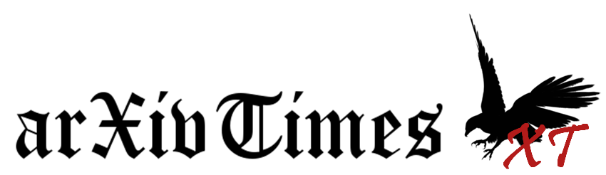

# arXivTimes

機械学習関係の論文を調査し、共有するためのリポジトリです。

**Follow Me on the Twitter!**

[@arxivtimes](https://twitter.com/arxivtimes)

論文輪講も併せて実施しています。輪講の内容はこちらから

[arXivTimes Medium](https://medium.com/@arxivtimes)

# Contents

* [Article Summaries](https://github.com/arXivTimes/arXivTimes/issues)
  * 論文の一言まとめ、また概要をIssueで管理しています。
* [Datasets](https://github.com/arXivTimes/arXivTimes/tree/master/datasets)
  * 機械学習に利用可能なデータセットをまとめています。
* [Tools](https://github.com/arXivTimes/arXivTimes/tree/master/tools)
  * 機械学習モデルの実装に役立つツールをまとめています。
* Conference Related Papers
  * arXivTimesに投稿された論文のうち、学会に提出された論文を年代ごとにまとめています。
  * [NIPS](https://github.com/arXivTimes/arXivTimes/projects/1)
  * [ICML](https://github.com/arXivTimes/arXivTimes/projects/3)
  * [ICLR](https://github.com/arXivTimes/arXivTimes/projects/2)
  * [ACL](https://github.com/arXivTimes/arXivTimes/projects/4)

# How to Contribute

論文のまとめを投稿する際は、以下の要領でお願いいたします。

* 登録したい論文は、Issueに登録を行ってください。
* Issueのタイトルを論文とし、内容はIssue Templateに従ってください。登録時必須なのは以下点のみです
  * 一言でいうと
  * 論文リンク
  * 著者/所属機関 ※論文からのコピペでOK
  * 投稿日付 Submission dateです。yyyy/MM/ddの形式でお願いします。学会に提出されている場合は、それについても記載いただけると助かります(NIPS 2017など)
* 「一言でいうと」の分量は、Twitterで呟ける程度が目安です。問題設定・アプローチ手法・結果が端的にまとまっているのがよい「一言」です。未読の人になるべくその内容が伝わるよう、工夫を凝らしてください。
* Issueのより詳細な内容について記載を行う場合は、担当者に(Assignees)自分を設定してください。これは読んでいる論文のバッティングを防ぐための措置です
* 論文の内容に応じて、Labelをつけてください(現時点ではContributorのみ付与可能なので、投稿頂いた場合こちらで付与を行わせていただきます)
* コメントには、論文を読んでの所感や評価、また理解が難しい点などがあったらその旨を記載してください

なお、まとめについて内容に自信がない、という場合はコメントで@arxivtimesbotに対してメンションでレビューを依頼できます。

レビューの依頼が行われると、arXivtimesのメンバーがレビューします。

タグを増やしたい、テンプレートを変えたい、という要望は`proposal`のタグをつけてIssueにあげてください。

また、その他のコンテンツについては他のOSS同様、Pull Requestにてお願いいたします。
